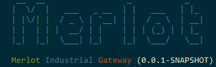
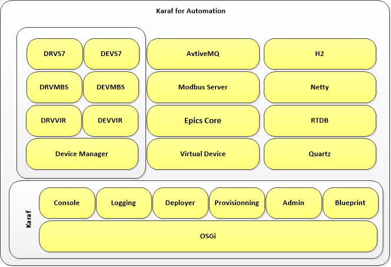

# 

## A brief introduction

Merlot (Karaf for Automation), is the implementation of a communications gateway for process automation using open source tools. Merlot is based on Karaf [1] a container for Java objects and applications based on OSGi technology [2].

In Merlot the code written for the development of gateway will be open source. This code will be optimized for use in embedded devices, and testing of IoT technology with Siemens S7 controllers.

During the development will benefit each of the features available in Karaf, for example: Hot deployment, Dynamic configuration, Logging System, Provisioning, Native OS integration, Shell Extensible console, Remote acces, Security framework, Managing instances, etc.

In short Merlot it comes as a communications gateway, specifically aimed at industrial applications and developed from scratch from the Karaf platform.

## About the architecture of Merlot

The following image is a quick view of the fundamental components for which we will make a brief description

Of the components of Merlot:

* **Quartz** [3]: is the component for scheduling tasks within Merlot. Karaf provides a "feature" that allows transparently urge as well as an OSGi service to the planned execution of tasks. This will be our next item of business.

* **ActiveMQ** [4]: This is a broker for messaging, supports multiple protocols (for example MQTT) for the server and client libraries for multiple languages. ActiveMQ is the key to the integration of components based on IoT base.

* **Virtual Device**: Since the aim of Merlot is to serve as a gateway for communication in process automation, the model of virtual devices associated with Merlot will be based on a MODBUS device type records. This concept will be used for shared memory model between the various components.

* **Netty** [5]: This library enables the development of high-performance servers and very efficient in the management of host resources.

* **MODBUS Server**: access to Merlot from field devices, either from a PLC, SCADA or HMI, can be performed using this protocol, one of the simplest and most used in industry. The server will be based on so Netty is expected to be very efficient in performance.

* **RTB (Real Time Database)**: I think this is a more complicated and difficult to implement parts. It is important to note that at no time think will reinvent the wheel in this regard, so we'll use a project called pvDatabaseJava, developed for the EPICS project. There are tons of documents, presentations and tutorials. In another publication of the blog  we will summarize these services

* **H2** [6]: For data persistence and Remote Access configuration will use this database. The evaluations resource consumption is minimal so it is my leading candidate. The implementation of the database is done using JPA, so persistence is actually transparent.

* **EpicsCoreJava** [7]: The component for the development of the database in real time (soft real time). It is a set of libraries and applications that allows access to the database through the CA V3 protocol, developed in the EPICS project.

* **Device Manager**: the manager devices is the service responsible for linking devices (dev) with their respective drivers (DRV). Connecting our PLC or RTU passes by this component. Like the rest of the service to be developed it is based on OSGi, so that the development process is standardized.

* **Native drivers** [8]: All the native drivers will follow as a reference the APIs developed by the Apache PLC4X project, as well as their implementations. So we can have really compatible versions, avoiding the particularities of each protocol.

## Documentation

The documentation of the project will be done on the Wiki provided by GitHub.

The scope of applications is quite wide, so the documentation will be oriented to specific examples, for example the integration of Merlot in an existing control architecture.

## Why the name of Merlot?

In the world of wines "Karaf" is basically a wine jug. From there is "Merlot" is a type of wine that will be contained in the Karaf jug.

## Links
1. https://karaf.apache.org/
2. https://www.osgi.org/
3. http://www.quartz-scheduler.org/
4. https://activemq.apache.org/
5. https://netty.io/
6. https://www.h2database.com/html/main.html
7. https://epics.anl.gov/
8. https://plc4x.apache.org/
